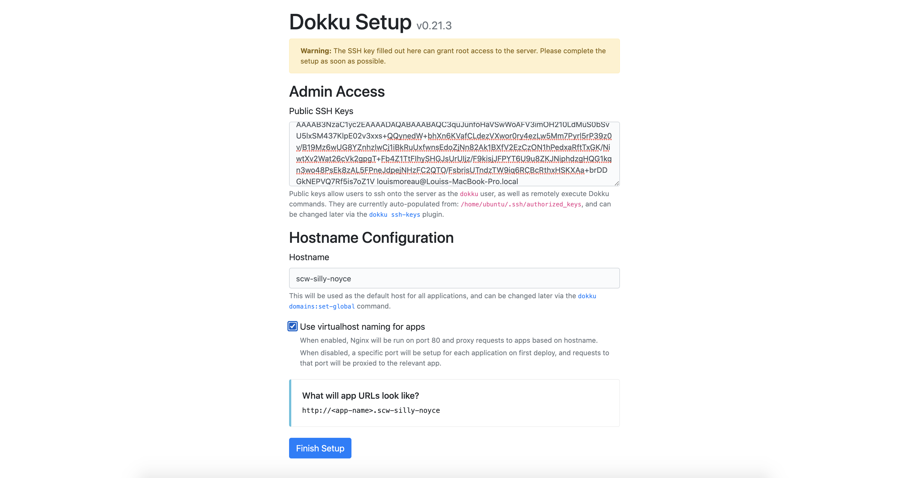
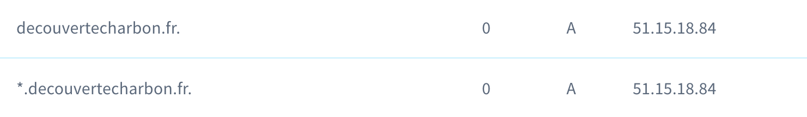

# Découverte du charbon en France

Ce projet a été développé pour mettre en ligne les recherches de Xavier Cavrois sur la découverte du charbon en France.
Retrouvez les étapes pour la mise en ligne d'un site web statique en utilisant Dokku.

## Installation de Dokku sur un serveur Ubuntu

Pour ce projet, la dernière version d'Ubuntu ([20.04 LTS, Focal Fossa](https://ubuntu.com/download/server)) a été utilisé.

Pour installer Dokku, connectez-vous en SSH sur la machine et lancer les commandes suivantes:

```
wget https://raw.githubusercontent.com/dokku/dokku/v0.21.3/bootstrap.sh;
sudo DOKKU_TAG=v0.21.3 bash bootstrap.sh
```

Le script prend quelques minutes à installer toutes les dépendances nécessaires. Retrouver aussi la [documentation officielle](http://dokku.viewdocs.io/dokku/getting-started/installation/).

Connectez-vous ensuite sur l'adresse IP de votre serveur et vous devriez voir l'interface suivante :


## Configurer le nom de domaine

Il vous faudra évidemment un nom de domaine, dans mon cas, j'ai acheté le nom de domaine [decouvertecharbon.fr](ddecouvertecharbon.fr).
Pour rediriger le trafic vers votre application Dokku, il vous faudra configurer deux zones DNS:
Ajoutez donc deux entrées type A vers votre adresse IP:



## Créer une application sur Dokku

Lancez maintenant la commande suivante sur votre serveur :

```
dokku apps:create decouvertecharbon.fr
```

Une application vide va être créée.

## Configurer les certificats SSL

Installons et configurons maintenant le plugin Letsencrypt pour sécuriser votre site avec HTTPS:

```
sudo dokku plugin:install https://github.com/dokku/dokku-letsencrypt.git
dokku config:set --global DOKKU_LETSENCRYPT_EMAIL=your-email@your-domain.com
```

Enfin, tapez la commande suivante (en prenant soin de remplacer `decouvertecharbon.fr` par votre nom de domaine) pour que votre site utilise HTTPS :

```
dokku letsencrypt decouvertecharbon.fr
```

## Configurer son projet

